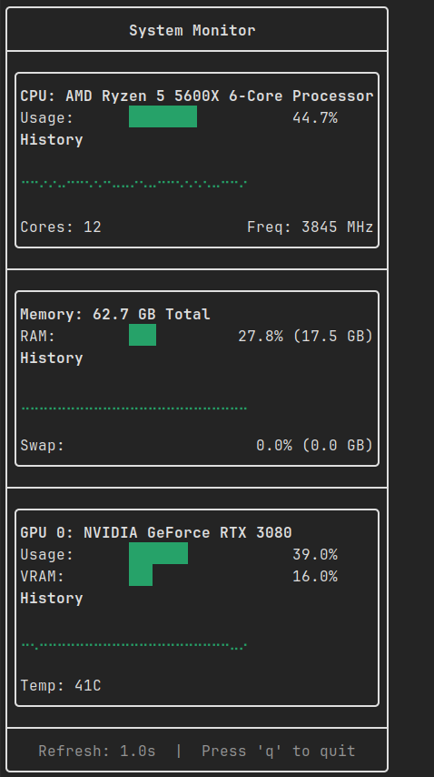

# atop-monitor

A beautiful terminal-based system monitor built with [FTXUI](https://github.com/ArthurSonzogni/FTXUI). Real-time monitoring of CPU, Memory, and NVIDIA GPU usage with trend charts.


## Features

- 📊 **Real-time CPU Monitoring**
  - CPU usage percentage
  - CPU frequency
  - Multi-core support
  - 5-second trend chart

- 💾 **Memory Tracking**
  - RAM usage and total
  - Swap usage
  - Buffer/Cache info
  - 5-second trend chart

- 🎮 **Multi-GPU Support**
  - NVIDIA GPU monitoring via NVML
  - Multiple GPU support
  - GPU usage and VRAM
  - Temperature monitoring
  - Per-GPU trend charts

- 🎨 **Beautiful Terminal UI**
  - Progress bar gauges with color coding
  - Real-time trend charts
  - Color-coded alerts (Green/Yellow/Red)
  - Clean border layout

## Screenshot



## Quick Install

```bash
curl -sSL https://raw.githubusercontent.com/Atticlmr/atop-monitor/master/install.sh | bash
```

Or download pre-built releases:

| Architecture | Download |
|--------------|----------|
| x86_64 (amd64) | [atop-monitor-linux-amd64](https://github.com/Atticlmr/atop-monitor/releases/latest) |
| aarch64 (arm64) | [atop-monitor-linux-arm64](https://github.com/Atticlmr/atop-monitor/releases/latest) |

After download:
```bash
chmod +x atop-monitor-linux-amd64
sudo mv atop-monitor-linux-amd64 /usr/local/bin/atop-monitor
```

## Requirements

- Linux operating system
- C++17 compatible compiler (GCC 7+ or Clang 5+)
- CMake 3.14+
- NVIDIA GPU drivers (optional, for GPU monitoring)

## Installation

### From Source

1. Clone the repository:
```bash
git clone https://github.com/Atticlmr/atop-monitor.git
cd atop-monitor
```

2. Build the project:
```bash
mkdir build && cd build
cmake ..
make -j$(nproc)
```

3. Install to system:
```bash
sudo make install
```

This will install `atop-monitor` to `/usr/local/bin/`, making it available system-wide.

### Uninstall

```bash
sudo make uninstall
```

## Usage

Simply run:
```bash
atop-monitor
```

Press `q` to quit.

## Keyboard Controls

| Key | Action |
|-----|--------|
| `q` | Quit the application |

## Build Options

### Custom Install Prefix

To install to a custom location:
```bash
cmake -DCMAKE_INSTALL_PREFIX=/your/custom/path ..
make
make install
```

Then add to your PATH:
```bash
export PATH=/your/custom/path/bin:$PATH
```

### Debug Build

```bash
cmake -DCMAKE_BUILD_TYPE=Debug ..
make
```

## Architecture

```
atop-monitor/
├── CMakeLists.txt          # CMake configuration
├── src/
│   ├── main.cpp            # Application entry
│   ├── cpu_monitor.cpp     # CPU monitoring
│   ├── memory_monitor.cpp  # Memory monitoring
│   ├── gpu_monitor.cpp     # GPU monitoring (NVML)
│   └── ui/
│       └── dashboard.cpp   # FTXUI dashboard
└── README.md
```

## How It Works

### CPU Monitoring
- Reads `/proc/stat` for CPU statistics
- Calculates usage from idle/total time differences
- Samples every 100ms, updates display every 1s
- Maintains 50-sample history (5 seconds)

### Memory Monitoring
- Reads `/proc/meminfo` for memory statistics
- Calculates actual usage: `MemTotal - MemAvailable`
- Tracks RAM and Swap separately
- 5-second trend history

### GPU Monitoring
- Uses NVIDIA Management Library (NVML)
- Dynamically loaded to avoid hard dependency
- Supports multiple GPUs
- Per-GPU history tracking

## Dependencies

- [FTXUI](https://github.com/ArthurSonzogni/FTXUI) - Terminal UI library
- NVIDIA drivers (optional) - For GPU monitoring

## Contributing

1. Fork the repository
2. Create your feature branch (`git checkout -b feature/amazing-feature`)
3. Commit your changes (`git commit -m 'Add amazing feature'`)
4. Push to the branch (`git push origin feature/amazing-feature`)
5. Open a Pull Request

## License

This project is licensed under the MIT License - see the LICENSE file for details.

## Acknowledgments

- [FTXUI](https://github.com/ArthurSonzogni/FTXUI) for the excellent terminal UI library
- NVIDIA for the NVML library

## Troubleshooting

### GPU not detected
Ensure NVIDIA drivers are installed and `libnvidia-ml.so` is available in your library path.

### Build errors
Make sure you have all dependencies installed:
```bash
sudo apt-get install build-essential cmake
```

## Future Improvements

- [ ] Network monitoring
- [ ] Disk I/O statistics
- [ ] Process list
- [ ] Configuration file support
- [ ] Customizable refresh rate
- [ ] Export data to CSV

---

Made with ❤️ using FTXUI
